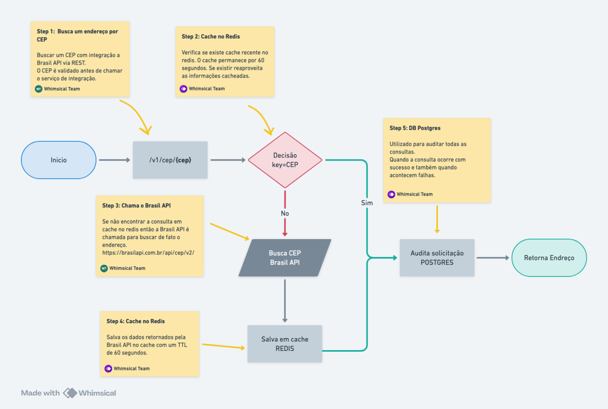

# Template Spring Boot Project

This is a template project for Spring Boot applications using spring boot + API + Redis + JPA + Postgres.

# Getting Started

## Prerequisites
- Java 17+
- Maven 3.6++
- PostgreSQL
- Redis
- Docker
- cURL

## Flow


### Maven commands
```bash
# Install Dependencies
./mvnw clean install -DskipTests 

# Run the Application
./mvnw clean compile spring-boot:run
./mvnw -Dspring-boot.run.arguments="--spring.liquibase.enabled=true" -Dspring-boot.run.profiles=prod spring-boot:run
```

### Testing API with CURL
```bash
curl -s -X GET "http://localhost:8080/v1/cep/89883000" -H "Accept: application/json"
```

by: https://start.spring.io/